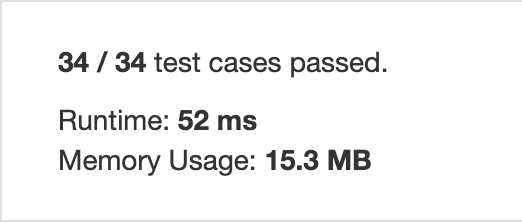
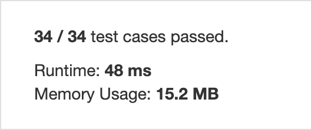

Difficulty: ***EASY***

Given an array, rotate the array to the right by k steps, where k is non-negative.

**Example 1:**

    Input: [1,2,3,4,5,6,7] and k = 3
    Output: [5,6,7,1,2,3,4]
    Explanation:
    rotate 1 steps to the right: [7,1,2,3,4,5,6]
    rotate 2 steps to the right: [6,7,1,2,3,4,5]
    rotate 3 steps to the right: [5,6,7,1,2,3,4]
    
**Example 2:**

    Input: [-1,-100,3,99] and k = 2
    Output: [3,99,-1,-100]
    Explanation: 
    rotate 1 steps to the right: [99,-1,-100,3]
    rotate 2 steps to the right: [3,99,-1,-100]
    
**Note:**

- Try to come up as many solutions as you can, there are at least 3 different ways to solve this problem.
- Could you do it in-place with O(1) extra space?
    
|Python file|% result vs other submissions|Runtime and memory usage|
|:---:|:---:|:---:|
|solution.py|||
|solution2_better.py|||
