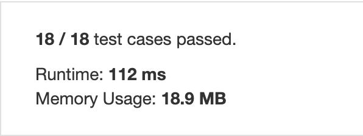

Difficulty: ***EASY***

Given an array of integers, find if the array contains any duplicates.

Your function should return true if any value appears at least twice in the array, and it should return false if every element is distinct.

**Example 1:**

    Input: [1,2,3,1]
    Output: true
    
**Example 2:**

    Input: [1,2,3,4]
    Output: false

**Example 3:**

    Input: [1,1,1,3,3,4,3,2,4,2]
    Output: true
    

|% result vs other submissions|Runtime and memory usage|
|:---:|:---:|
|||