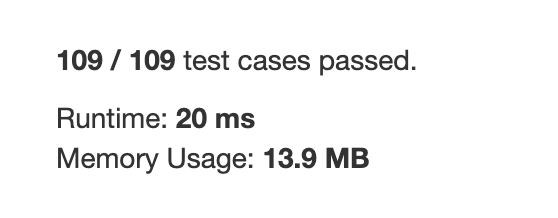

Difficulty: ***EASY***

Given a **non-empty** array of digits representing a non-negative integer, plus one to the integer.

The digits are stored such that the most significant digit is at the head of the list, and each element in the array contain a single digit.

You may assume the integer does not contain any leading zero, except the number 0 itself.

**Example 1:**

    Input: [1,2,3]
    Output: [1,2,4]
    Explanation: The array represents the integer 123.

**Example 2:**

    Input: [4,3,2,1]
    Output: [4,3,2,2]
    Explanation: The array represents the integer 4321.

|Python file|% result vs other submissions|Runtime and memory usage|
|:---:|:---:|:---:|
|solution.py|||
